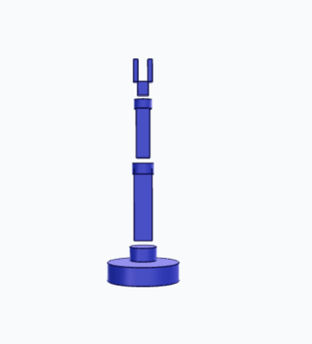

# AgentCAD
A Library for using agents to quickly developing 3D model

### Installation

**note** : I am currently facing issues using `uv` to install `cadquery` for python 3.12. 
I will do more experminent to try for `uv` based installation. for now i use pip.

make a a virtual environment

`python -m venv .venv`

activate your environment. 

`source /.venv/bin/activate`

install the packages 

`pip install -r requirements.txt`

### Running an example code

#### Example Input
```
python step_generating_agent.py "make a simple robot arm"
```

#### Example Output

```
Done! I've created a simple robot arm with the following features:

- **Base**: A cylindrical platform (40mm radius, 20mm height)
- **Shoulder joint**: First rotating joint
- **Upper arm**: 80mm long rectangular segment
- **Elbow joint**: Second rotating joint
- **Forearm**: 60mm long rectangular segment
- **Wrist joint**: Third rotating joint
- **Gripper**: Simple two-finger gripper at the end

The robot arm is approximately 237mm tall and has a classic articulated design with three joints that would allow rotation and positioning in 3D space. The file has been saved as `simple_robot_arm.step` which you can open in any CAD software!
```

#### Example Validation

For my valiadtion i used i webpage i [vibe-coded](v0-render-step-files.vercel.app)



### Additional notes
- i may build an adapter for other agentic frameworks but for now i will focus on `langchain` and `ADK`
- i may set a MCP server
- I use liteLLM to allow for easier LLM switching

### References

- https://github.com/hwchase17/autoresearch-agents from Harrison Chase himself in which i build my intial langchain agentic framework on
- https://github.com/isayahc/digitizer from an Google Deepmind Hackathon. I plan to use this to 
help me add animations and potentially allow users to interact with digital assets